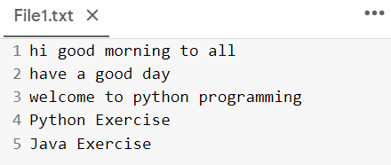
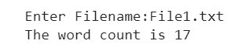

# Word-count
## AIM:
To write a python program for getting the word count from a text.
## EQUIPEMENT'S REQUIRED: 
PC
Anaconda - Python 3.7
## ALGORITHM: 
### Step 1:
Create a function that prompts user to give a name of a text file to count the number of words in it.
### Step 2: 
 Use input prompt to open the file in read mode.
### Step 3: 
Use split() to split the file into words.
### Step 4:  
Count the number of words using for loop.
### Step 5: 
Print the word count
### Step 6: 
Call the funtion
## PROGRAM:
~~~
'''
Python program for getting the word count from a text.
Developed by: Shrruthilaya G
RegisterNumber: 21002893
'''
def wordcount(filen):
  count = 0
  with open(filen,"r") as f1:
    data=f1.read()
    for line in data.split():
      count += 1
  print("The word count is", count)
filename=input("Enter Filename:")
wordcount(filename)
~~~
## OUTPUT:
### Text File "File1.txt":

### Output of the code:

## RESULT:
Thus the program is written to find the word count from a text.
